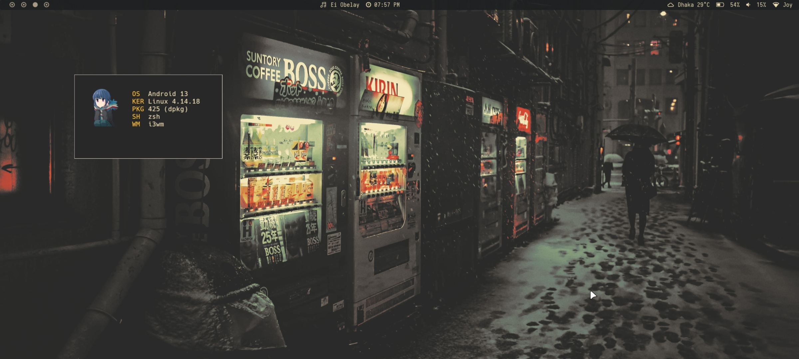
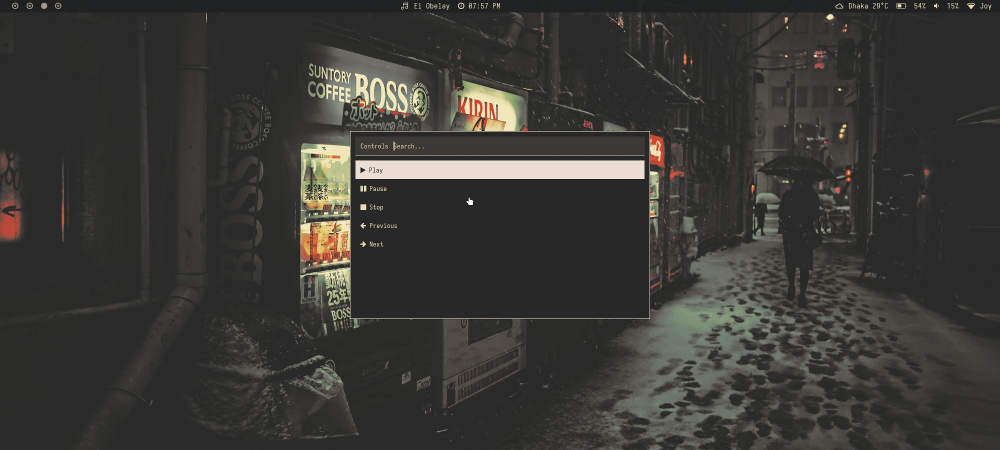
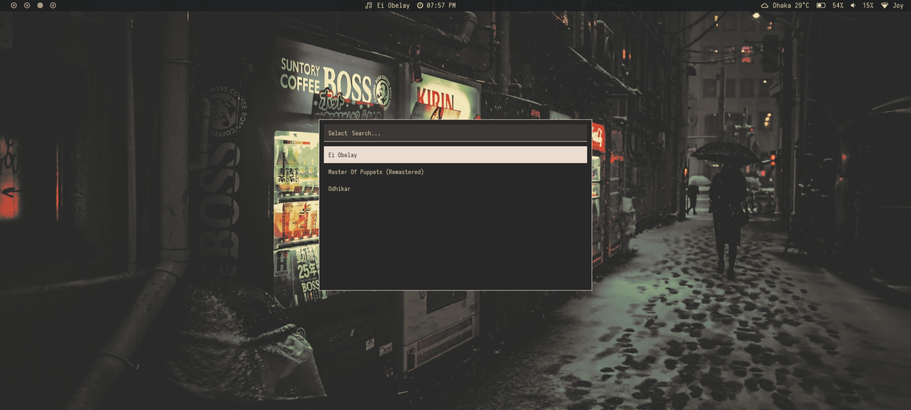

# My Dotfiles

This repository contains my configuration files (.dotfiles) for Linux and Termux.  
It includes window manager, terminal, themes, polybar with custom modules for Termux and music player.



# Configuration Documentation

### Modifier Key

``$mod`` is set to ***Mod1***, usually the Alt key.

This key is used in combination with other keys to perform actions.

### Application Shortcuts

```Alt+Return``` → Open Kitty terminal.

```Alt+e``` → Open Thunar file manager.

```Alt+Space``` → Launch Rofi application menu.

```Alt+c``` → Run MPV control menu.



```Alt+x``` → Run MPV select music.



```Alt+q``` → Close focused window.


### Window Focus


```Alt+j``` or ```Alt+Left``` → Left

```Alt+k``` or ```Alt+Down``` → Down

```Alt+l``` or ```Alt+Up``` → Up

```Alt+;``` or ```Alt+Right``` → Right

### Layouts and Splits

```Alt+h``` → Split window horizontally.

```Alt+v``` → Split window vertically.

```Alt+f``` → Toggle fullscreen mode.

```Alt+w``` → Switch to tabbed layout.

```Alt+s``` → Toggle between split and stacking layouts.

```Alt+Shift+Space``` → Toggle floating mode for the focused window.

```Alt+Shift+t``` → Toggle focus mode (tree/tiling).

```Alt+a``` → Focus parent container in layout hierarchy.

### Reload & Restart i3

```Alt+Shift+z``` → Reload i3 configuration (apply changes).

```Alt+Shift+r``` → Restart i3 without logging out.
